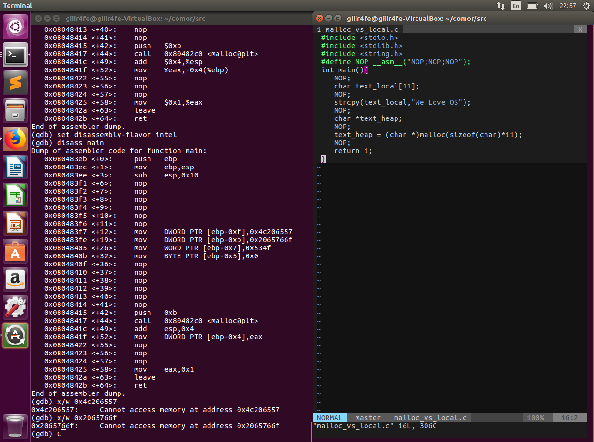

# OS-Malloc-and-heap
เธอๆ รู้จัก Stack,Heap,Malloc,realloc ป่าว ถ้าไม่รู้จักมานี่เลย เดี้ยวเราสอนให้
แต่ก่อนจะไปรู้จักมัน มารู้จัก memory diagram กันก่อนดีกว่า
## memory diagram

<br>

ดูภาพแล้วอาจดูงงๆ แต่เข้าใจง่ายกว่าผู้หญิงแน่นอน ส่วนที่เราจะสนใจจริงๆ มีสองอันคือ Stack กับ Heap <br>
Stack พื้นที่ที่เราใช้เก็บตัวแปรประเภท Local ซึ่งตรงนี้มันถูกจัดการด้วย complier แหละ
Heap หรือ dynamic data ตรงนี้เราเอาไว้เก็บตัวแปรที่เป็น dynamic หรือพูดง่ายๆคือตัวแปรที่เกิดจากการ malloc หรือ calloc นั้นแหละ ซึ่งพื้นที่ตรงนี้เราสามารถย่อขยายได้ตามต้องการหรือใน C เราใช้ realloc นั้นแหละ(ยังกะไฟฉายขยายส่วน)

## Dynamic Variable Vs Local Variable [after compile]
<br>
จากภาพด้านบนจะเห็นว่าเมื่อเราประกาศตัวแปรแบบ Local ไม่ว่าจะประกาศไว้ที่ไหน Compiler ก็จะนำทำหลังจากเข้า function นั้นๆ ทันที
ต่างจาก malloc ที่ เราจะใช้ค่าตอนไหนก็ค่อยไปเรียก malloc เพื่อจัดการขยาย memory ให้เรา

## จาก malloc_no_nop.c
``` C
#include <stdio.h>
#include <stdlib.h>
#include <string.h>


int main(){
    char text_local[6] = "LOCAL";
    printf("text_local: %s    %p\n",text_local,text_local);
    char *text_heap;
    text_heap = (char *)malloc(sizeof(char)*5);
    strcpy(text_heap,"TEST");
    printf("text_heap: %s    %p\n",text_heap,text_heap);
    printf("---Reallocation text_heap---\n");
    text_heap = (char *)realloc(text_heap,sizeof(char)*12);
    strcpy(text_heap,"OS IS EASY.");
    printf("text_heap: %s    %p\n",text_heap,text_heap);
    return 0;
    free(text_heap);
}
```
ผลลัพท์ที่ออกมาคือ
```
text_local: LOCAL    0xbfffeeee
text_heap: TEST    0x804a410
---Reallocation text_heap---
text_heap: OS IS EASY.    0x804a410
```

```
0x804a000  0x806b000    0x21000        0x0 [heap]
0xbffdf000 0xc0000000    0x21000        0x0 [stack]
```


## ref

http://www.bogotobogo.com/cplusplus/assembly.php
